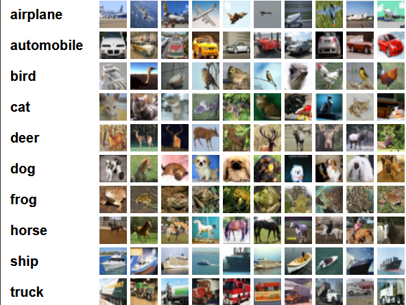

# 快速开始
使用Pet训练CIFAR10分类模型

通过阅读本教程，您可以了解使用Pet在CIFAR10数据集上训练和测试一个分类器的简要步骤。如果想要了解更多内容，请点击以下链接：

* 在ImageNet数据集上训练分类模型的详细案例见[ImageNet分类教程](../tutorials/basic/cls_zh.md)。

下面介绍CIFAR分类训练和测试的流程：

## 准备数据

* 下载：训练前，先将[python版本的CIFAR数据](https://www.cs.toronto.edu/~kriz/cifar-10-python.tar.gz)下载到本地并完成解压，CIFAR数据内容和类别如下：



* 路径：将数据已经直接或以软连接的形式存放在`$Pet/data`文件路径下，文件结构如下：

```
cifar
  |--cifar-10-batches-py
    |--data_batch_1
    |--data_batch_2
    |--data_batch_3
    |--data_batch_4
    |--data_batch_5
    |--test_batch
    ...
```

建立`$CIFAR`数据集路径到`$Pet/data`的软连接：

```
ln -s $CIFAR $Pet/data
```


## 预训练模型

如需迁移其他网络的训练参数来进行当前任务的训练，请将要进行迁移的网络模型放到`$Pet/weights`路径下。作为基本的分类任务，Pet在训练CIFAR数据时，选择了直接随机初始化。

## 分类训练和测试

使用Pet训练和测试CIFAR10分类模型时，需要指定一个YAML文件，该文件里包含了所有训练和测试时使用到的可以调节的超参数，这里以[$Pet/cfgs/cls/cifar/resnext29-8x64d_cifar10.yaml](https://github.com/BUPT-PRIV/Pet-dev/blob/main/cfgs/vision/Cifar/resnext29-8x64d_cifar10.yaml)为例进行介绍。

训练用法示例：

```
cd $Pet

python tools/train_net_all.py --cfg=cfgs/vision/Cifar/resnext29-8x64d_cifar10.yaml
```

在训练正常运行时，会在控制台输出如下的日志信息。

```
[Training][resnext29-8x64d_cifar10.yaml][epoch: 1/300][iter: 20/196][lr: 0.100000][eta: 1 day, 1:28:29]
      total_loss: 2.264606 (2.198514), iter_time: 0.4097 (1.5602), data_time: 0.0019 (0.0021)
      acc1: 22.2656 (19.7266), acc5: 71.4844 (70.0586)
[Training][resnext29-8x64d_cifar10.yaml][epoch: 1/300][iter: 40/196][lr: 0.100000][eta: 15:49:45]
      total_loss: 1.991784 (2.129857), iter_time: 0.4080 (0.9698), data_time: 0.0022 (0.0021)
      acc1: 23.4375 (22.0312), acc5: 81.2500 (74.6777)
[Training][resnext29-8x64d_cifar10.yaml][epoch: 1/300][iter: 60/196][lr: 0.100000][eta: 12:43:38]
      total_loss: 1.797434 (2.069275), iter_time: 0.4100 (0.7800), data_time: 0.0020 (0.0021)
      acc1: 30.8594 (24.0299), acc5: 84.7656 (77.0508)
[Training][resnext29-8x64d_cifar10.yaml][epoch: 1/300][iter: 80/196][lr: 0.100000][eta: 11:11:46]
      total_loss: 1.910455 (2.017684), iter_time: 0.4116 (0.6864), data_time: 0.0020 (0.0021)
      acc1: 27.7344 (25.7080), acc5: 82.0312 (78.8721)
      ......
```

训练结束后，会将最后一次训练的模型以及效果最好的模型保存到`$Pet/ckpts/cls/cifar`路径下。接下来开始`$Pet/tools/cls/test_net.py`进行测试功能过程的介绍。

测试用法示例：

```
cd $Pet

python tools/test_net_all.py--cfg cfgs/vision/Cifar/resnext29-8x64d_cifar10.yaml
```

测试结果：

```
INFO:pet.utils.misc:[Testing][range:1-250 of 250][249/250][120.903s = 120.747s + 0.154s + 0.002s][eta: 0:02:00][acc1:77.48% | acc5: 93.75%]
INFO:pet.utils.misc:[Testing][range:1-250 of 250][250/250][121.293s = 121.138s + 0.154s + 0.002s][eta: 0:00:00][acc1:77.44% | acc5: 93.75%]
INFO:pet.utils.misc:val_top1: 77.4360% | val_top5: 93.7520%
```

