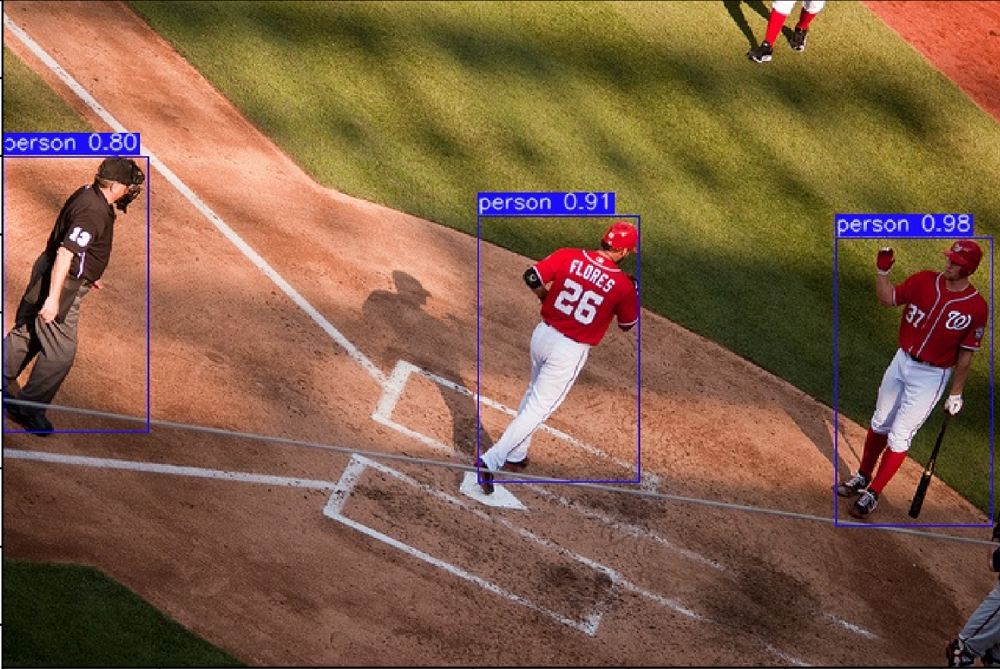

## 在MSCOCO2017数据集上训练Faster R-CNN模型

### 一、介绍

本教程将介绍使用Pet训练以及测试Faster R-CNN模型进行目标检测的主要步骤，在此我们会指导您如何通过组合Pet的提供组件来训练Faster R-CNN模型，在此我们仅讲解组件的调用，部分实现细节请查阅系统组件的相应部分。

在阅读本教程的之前我们强烈建议您阅读原始论文[Faster R-CNN[1]](https://arxiv.org/abs/1506.01497)以了解更多关于Faster R-CNN的算法原理。MSCOCO2017数据集可通过[官方链接](https://cocodataset.org/#download)下载。


### 二、快速开始

如果您具有丰富的目标检测算法的研究经验，您也可以直接在Pet中运行`$Pet/tools/train_net_all.py` 或 `$Pet/tools/test_net_all.py` 脚本立即开始训练或测试您的Faster R-CNN模型。

### 三、用法示例

* **训练**

使用8块GPU在MSCOCO2017上训练一个端到端的Faster R-CNN模型：  
```python
cd $Pet
python tools/train_net_all.py --cfg cfgs/vision/COCO/e2e_faster-impr_rcnn_R-50-C4_1x_ms.yaml
```

指定特定的GPU在MSCOCO上训练一个端到端的Faster R-CNN模型：
```python
cd $Pet
python tools/train_net_all.py --cfg cfgs/vision/COCO/e2e_faster-impr_rcnn_R-50-C4_1x_ms.yaml --gpu_id 0,1,2,3
```

* **测试**

```python
cd $Pet
python tools/test_net_all.py --cfg ckpts/vision/COCO/e2e_faster-impr_rcnn_R-50-C4_1x_ms.yaml
```

```python
cd $Pet
python tools/test_net_all.py --cfg ckpts/vision/COCO/e2e_faster-impr_rcnn_R-50-C4_1x_ms.yaml --gpu_id 0,1
```


### 四、构建实验配置文件

在进行任何与模型训练和测试有关的操作之前，需要先指定一个YAML文件，明确在训练时对数据集、模型结构、优化策略以及其他重要参数的需求与设置，本教程以 `$Pet/cfgs/vision/COCO/e2e_faster-impr_rcnn_R-50-C4_1x_ms.yaml` 为例，讲解训练过程中所需要的关键配置，该套配置将指导此Faster R-CNN模型训练以及测试的全部步骤和细节，全部参数设置请见$Pet/cfgs/vision/COCO/e2e_faster-impr_rcnn_R-50-C4_1x_ms.yaml。

Pet以yaml文件格式定义并存储本次实验配置信息，并根据任务类型和所用数据集等信息将其保存在cfgs目录下的相应位置。以 `$Pet/cfgs/vision/COCO/e2e_faster-impr_rcnn_R-50-C4_1x_ms.yaml` 为例，其包含的大致配置信息如下(所有默认基础配置可在 `$Pet/pet/lib/config/` 目录下查询)：

```python
MISC: # 基础配置
  ...
MODEL: # 模型配置
  ...
SOLVER: # 优化器及调度器配置
  ...
DATA: # 数据相关配置
  ...
TRAIN: # 训练配置
  ...
TEST: # 测试配置
  ...
```

### 五、数据集准备和介绍
微软发布的MSCOCO数据库是一个大型图像数据集，专为对象检测、分割、人体关键点检测、语义分割和字幕生成而设计。


MSCOCO数据库的网址是:
* MSCOCO数据集主页：[https://cocodataset.org/](https://cocodataset.org/)
* Github网址：[https://github.com/cocodataset/](https://github.com/cocodataset/)

[cocoapi](https://github.com/cocodataset/cocoapi/)提供了Matlab，Python和Lua的调用接口。该API可以提供完整的图像标签数据的加载、分析和可视化。此外，网站还提供了数据相关的文章和教程。

在使用MSCOCO数据库提供的API和demo之前, 需要首先下载MSCOCO的图像和标签数据（类别标志、类别数量区分、像素级的分割等），Pet需要从MSCOCO中下载以下内容：

| 文件名 | 大小 |
| :-----: | :-: |
| [train2017.zip](http://images.cocodataset.org/zips/train2017.zip) | 18GB | 
| [val2017.zip](http://images.cocodataset.org/zips/val2017.zip) | 1GB 
| [annotations_trainval2017.zip](http://images.cocodataset.org/annotations/annotations_trainval2017.zip) | 241MB |


* 图像数据下载到`$Pet/data/COCO/`文件夹中
* 标签数据下载到`$Pet/data/COCO/annotations/`文件夹中

```python
COCO
├── annotations
├── train2017
└── val2017
```


### 六、数据加载
yaml配置文件的数据集部分信息(更多默认配置参考`$Pet/pet/lib/config/data.py`)：
```python
## $Pet/cfgs/vision/COCO/e2e_faster-impr_rcnn_R-50-C4_1x_ms.yaml
DATA:
  # yaml配置
  PIXEL_MEAN: (0.485, 0.456, 0.406)
  PIXEL_STD: (0.00392, 0.00392, 0.00392)
  # 默认配置，在pet/lib/config/data.py中
  DATASET_TYPE = "coco_dataset"
...
TRAIN:
  ...
  DATASETS: ("coco_2017_train",)
  SIZE_DIVISIBILITY: 0
  RESIZE:
    SCALES: (640, 672, 704, 736, 768, 800)
    MAX_SIZE: 1333
TEST:
  DATASETS: ("coco_2017_val",)
  RESIZE:
    SCALE: 800
    MAX_SIZE: 1333
```

根据配置文件构建训练数据集和加载器,核心调用`$Pet/pet/vision/datasets/dataset.py`下的`build_dataset`和`make_{train/test}_data_loader`
```python
## $Pet/tools/vision/train_net.py
from pet.vision.datasets.dataset import build_dataset, make_train_data_loader
from pet.vision.datasets.dataset import build_dataset, make_test_data_loader

# 构建训练数据集和加载器
dataset = build_dataset(cfg, is_train=True)
start_iter = checkpointer.checkpoint['scheduler']['iteration'] if checkpointer.resume else 1
train_loader = make_train_data_loader(cfg, dataset, start_iter=start_iter)
```
```python
## $Pet/tools/vision/train_net.py

# 构建测试数据集和加载器
dataset = build_dataset(cfg, is_train=False)
test_loader = make_test_data_loader(cfg, dataset)
```

构建数据集的核心是通过解析配置文件相关参数，构建`cfg.DATA.DATASET_TYPE`对应的数据集类(相关代码在`$Pet/pet/lib/data/datasets/`)，构建数据集的核心代码如下：
```python
## $Pet/pet/vision/datasets/dataset.py
from pet.lib.data.datasets import (CifarDataset, COCODataset,
                                   COCOInstanceDataset, ConcatDataset,
                                   ImageFolderDataset)
def build_dataset(cfg, is_train=True):
    dataset_list = cfg.TRAIN.DATASETS if is_train else cfg.TEST.DATASETS # 要读取的数据集list，如：("coco_2017_train",)/("coco_2017_val",)

    ann_types = set()
    if cfg.MODEL.HAS_BOX: # infer_cfg():cfg.MODEL.GLOBAL_HEAD.DET.RPN_ON = True -> cfg.MODEL.HAS_BOX = True
        ann_types.add('bbox') # 要加载的标注类型
    ...

    # 根据cfg.DATA.DATASET_TYPE映射到对应的数据集类："coco_dataset" -> COCODataset
    dataset_obj = DATASET_TYPES[cfg.DATA.DATASET_TYPE]
    transforms = build_transforms(cfg, is_train) # 根据配置信息，对数据做预处理变换
    transforms.check_ann_types(ann_types)

    ...

    datasets = [] # 保存所有读取下载的数据集，有可能是多个数据集，用list存储

    # 为便于阅读，省去部分异常判断，如：未定义的数据集名称、图像目录或标注文件不存在、指定标注类型数据集不支持等
    for dataset_name in dataset_list:
        root = get_im_dir(dataset_name) # 获取数据集图片目录路径
        ann_file = get_ann_fn(dataset_name) # 获取标注文件路径
        ...

        # 根据上述对配置参数的解析，创建具体的数据集类对象
        dataset = dataset_obj(root, ann_file, ann_types, ann_fields, 
                              transforms=transforms,
                              is_train=is_train,
                              filter_invalid_ann=is_train,
                              filter_empty_ann=is_train,
                              filter_crowd_ann=True,    # TO Check, TODO: filter ignore
                              bbox_file=bbox_file,
                              image_thresh=image_thresh,
                              mosaic_prob=mosaic_prob)
        datasets.append(dataset) # 加入该数据集类对象到数据集列表

        logging_rank(f"Creating dataset: {dataset_name}.")

    # concatenate all datasets into a single one
    if len(datasets) > 1: # 如果要下载的数据集大于1，将对多个数据集进行拼接
        dataset = ConcatDataset(datasets)
        logging_rank(f"Concatenate datasets: {dataset_list}.")
    else:
        dataset = datasets[0]

    # 返回创建处理后的数据集类对象
    return dataset
```

构建数据加载器的核心调用是torch.utils.data.DataLoader,根据配置参数解析，确定 DataLoader 的各参数，包括batch_size,sampler,collect_fn等，sampler和collate_fn的自定义实现分别在 `$Pet/pet/lib/data/samplers` 和 `$Pet/pet/lib/data/collate_batch.py`。数据集加载分训练和测试两种情况，大致逻辑相似，为便于阅读，此处仅以测试集加载函数作为示例：
```python
## $Pet/pet/vision/datasets/dataset.py 
from torch.utils.data import BatchSampler, DataLoader, DistributedSampler
from pet.lib.data.collate_batch import BatchCollator
from pet.lib.data.samplers import (GroupedBatchSampler,
                                   IterationBasedBatchSampler,
                                   RepeatFactorTrainingSampler)

def make_test_data_loader(cfg, datasets):
    ims_per_gpu = cfg.TEST.IMS_PER_GPU
    test_sampler = DistributedSampler(datasets, shuffle=False)
    num_workers = cfg.DATA.LOADER_THREADS
    collator = BatchCollator(-1)
    data_loader = DataLoader(
        datasets,
        batch_size=ims_per_gpu,
        shuffle=False,
        sampler=test_sampler,
        num_workers=num_workers,
        collate_fn=collator,
    )

    return data_loader
```

### 七、模型构建
配置文件的模型搭建部分信息(更多默认配置在`$Pet/pet/lib/config/model`)：
```python
## $Pet/cfgs/vision/COCO/e2e_faster-impr_rcnn_R-50-C4_1x_ms.yaml
MODEL: # 模型配置
  BACKBONE: "resnet_c4" # 骨干网络配置，根据值"resnet_c4"还需找到相应骨干网络类"RESNET",对照其参数信息进行配置补充
  NECK: "" # 颈部，可选部分，本模型无颈部结构设计
  GLOBAL_HEAD: # GLOBAL_HEAD结构与任务高度相关，还需进一步在任务分装下指定结构，本实验是检测，对应 DET
    DET:
      RPN_ON: True # Faster-RCNN是两阶段检测器，需要通过RPN生成候选框,因此值为True，并对RPN配置进行补充
  ROI_HEAD: # ROI_HEAD的结构设计
    FASTER_ON: True 
  RESNET: # 骨干网络RESNET的构建参数
    LAYERS: (3, 4, 6, 3) 
  RPN: # GLOBAL_HEAD的RPNMoudle构建的参数
    PRE_NMS_TOP_N_TEST: 6000
    POST_NMS_TOP_N_TEST: 1000
    SMOOTH_L1_BETA: 0.0  # use L1Loss
  FASTER: # ROI_HEAD的FASTER构建的参数
    NUM_CLASSES: 80
    ROI_XFORM_METHOD: "ROIAlignV2"
    BOX_HEAD: "resnet_c5_head"
    ROI_XFORM_RESOLUTION: (14, 14)
    ROI_XFORM_SAMPLING_RATIO: 0  # SR0
    SMOOTH_L1_BETA: 0.0  # use L1Loss
```
根据yaml配置文件，通过GeneralizedCNN类实例化对应模型，在forward函数中按顺序控制数据传输。具体代码在`$Pet/pet/vision/modeling/model_builder.py`中：
```python
## $Pet/pet/vision//modeling/model_builder.py
from pet.vision.modeling.model_builder import GeneralizedCNN

class GeneralizedCNN(nn.Module):
    
        """ 视觉模型构建+前向函数定义    """
    def __init__(self, cfg: CfgNode) -> None:
        super(GeneralizedCNN, self).__init__()

        self.cfg = cfg
        # 构建faster-rcnn的backbone部分：ResNet
        Backbone = registry.BACKBONES[cfg.MODEL.BACKBONE]
        self.backbone = Backbone(cfg) 
        ...
        # Neck为""，无需构建此部分
        if cfg.MODEL.NECK: 
            Neck = registry.NECKS[cfg.MODEL.NECK]
            ...
        ...
        # 构建faster-rcnn的检测头：RPNModule
        if cfg.MODEL.GLOBAL_HEAD.DET_ON:# cfg.infer_cfg()调用，若cfg.MODEL.GLOBAL_HEAD.DET.RPN_ON = True，则cfg.MODEL.GLOBAL_HEAD.DET_ON = True
            self.global_det = GlobalDet(cfg, dim_in, spatial_in)
        # 在GlobalDet类中进一步创建 RPNModule
        # class GlobalDet(nn.Module):
        #     def __init__(self, cfg, dim_in, spatial_in):
        #         ...
        #         if self.cfg.MODEL.GLOBAL_HEAD.DET.RPN_ON:
        #             self.rpn = RPNModule(self.cfg, dim_in, spatial_in)

        # 构建faster-rcnn的roi_head
        if cfg.MODEL.ROI_HEAD.FASTER_ON:
            if cfg.MODEL.ROI_HEAD.CASCADE_ON:
                self.roi_cascade = ROICascade(cfg, dim_in, spatial_in)
            else:
                self.roi_fast = ROIFast(cfg, dim_in, spatial_in)
        ...
    ...
```

### 八、优化器与调度器
yaml配置文件的优化器及调度器部分信息(更多默认配置在`$Pet/pet/lib/config/solver.py`)：
```python
## $Pet/cfgs/vision/COCO/e2e_faster-impr_rcnn_R-50-C4_1x_ms.yaml
SOLVER:
  OPTIMIZER:
    BASE_LR: 0.02 # 基本学习率
  SCHEDULER:
    TOTAL_ITERS: 90000
    STEPS: (60000, 80000)
```

和其他组件一样，通过解析配置文件相关参数，传给`Optimizer`类(`$Pet/pet/lib/utils/analyser.py`)和`LearningRateScheduler`类(`$Pet/pet/lib/utils/lr_scheduler.py`),从而构建优化器及调度器，仅在训练阶段使用：
```python
## $Pet/tools/vision/train_net.py
from pet.lib.utils.optimizer import Optimizer
from pet.lib.utils.lr_scheduler import LearningRateScheduler

# 构建优化器
optimizer = Optimizer(model, cfg.SOLVER.OPTIMIZER).build()
optimizer = checkpointer.load_optimizer(optimizer)
...
# 构建调度器
scheduler = LearningRateScheduler(optimizer, cfg.SOLVER, iter_per_epoch=iter_per_epoch)
scheduler = checkpointer.load_scheduler(scheduler)
```

### 九、训练

在通过实验配置定义各组件及训练流相关操作后，我们就可以开始实验的训练。
训练的yaml配置(更多默认配置在`/pet/lib/config/data.py`)：
```python
## $Pet/cfgs/vision/COCO/e2e_faster-impr_rcnn_R-50-C4_1x_ms.yaml
TRAIN:
  WEIGHTS: "ckpts/vision/ImageNet/3rdparty/resnet/resnet50a_caffe/resnet50a_caffe_conv1-rgb.pth" # 预训练权重
  DATASETS: ("coco_2017_train",)
  SIZE_DIVISIBILITY: 0
  RESIZE:
    SCALES: (640, 672, 704, 736, 768, 800)
    MAX_SIZE: 1333
```
训练实现的核心代码在 `$Pet/tools/vision/train_net.py` 的train函数中定义，详细介绍请看[Pet的训练教程](https://github.com/BUPT-PRIV/Pet-doc/blob/dev/tutorials/training_zh.md)。

### 十、测试

测试的yaml配置(更多默认配置在`/pet/lib/config/data.py`)：
```python
## $Pet/cfgs/vision/COCO/e2e_faster-impr_rcnn_R-50-C4_1x_ms.yaml 
TEST:
  DATASETS: ("coco_2017_val",)
  RESIZE:
    SCALE: 800
    MAX_SIZE: 1333
```
测试实现的核心代码在 `$Pet/tools/vision/test_net.py` 的test函数中定义，详细介绍请看[Pet的测试教程](https://github.com/BUPT-PRIV/Pet-doc/blob/dev/tutorials/evaluation.md)。

### 十一、可视化结果

在Pet中Faster R-CNN返回每一个目标的类别、置信度分数和边界框坐标。将MSCOCO2017_val中的一张图片的推理结果进行可视化如下图。




### 参考文献
[1] Shaoqing Ren, Kaiming He, Ross Girshick, Jian Sun. Faster R-CNN: Towards Real-Time Object Detection with Region Proposal Networks. NIPS 2015.

