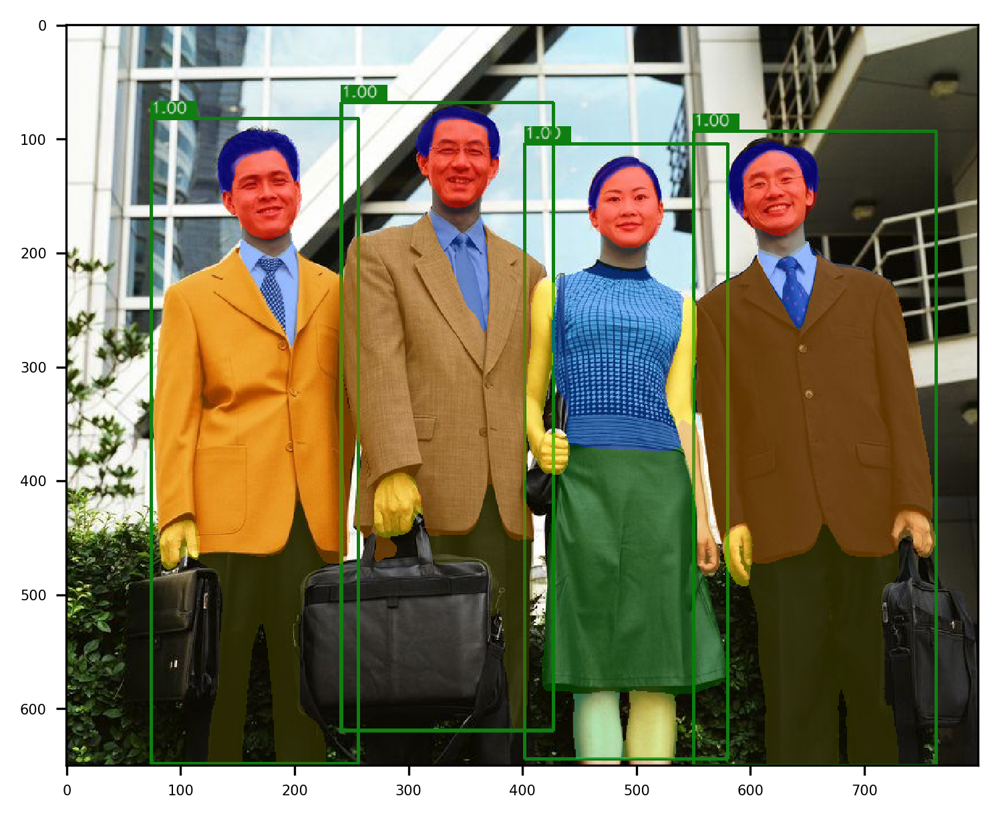

* **NOTE**:


点击[此处](https://github.com/BUPT-PRIV/Pet-Priv/blob/main/tools/train_net_all.py)查看训练的示例代码.

# 在CIHP数据集上训练Parsing教程
## 一、介绍

本部分以Parsing RCNN在CIHP数据集上的训练和测试为例，介绍使用Pet训练以及测试Parsing R-CNN模型进行人体部位分割的主要步骤。主要讲解组件的调用，部分实现细节请查阅系统组件的相应部分。在阅读本教程的之前我们强烈建议您阅读原始论文[Parsing R-CNN](https://arxiv.org/abs/1811.12596)[1]、[PGN](https://arxiv.org/pdf/1808.00157v1)[2]以了解更多关于Parsing R-CNN的算法原理。

## 二、快速开始
如果您具有丰富的人体部位分析算法的研究经验，您也可以直接在Pet中运行`$Pet/tools/train_net_all.py`脚本立即开始训练您的Parsing R-CNN模型.

## 三、用法示例：

* 训练：使用8块GPU在`CIHP_train`上训练一个端到端的Parsing R-CNN模型：

```
cd $Pet
CUDA_VISIBLE_DEVICES=0,1,2,3,4,5,6,7 python -m torch.distributed.launch --nproc_per_node=8 tools/train_net_all.py --cfg cfgs/vision/CIHP/e2e_parsing_rcnn_R-50-FPN_1x_ms.yaml
```

* 测试：使用8块GPU在`CIHP_val`数据集上测试Parsing R-CNN模型：

```
cd $Pet

CUDA_VISIBLE_DEVICES=0,1,2,3,4,5,6,7 python tools/test_net_all.py --cfg cfgs/vision/CIHP/e2e_parsing_rcnn_R-50-FPN_1x_ms.yaml 
```

## 四、构建实验配置文件
在进行任何与模型训练和测试有关的操作之前，需要先选择一个指定的YAML文件，明确对数据集、模型结构、优化策略以及其他重要参数的需求与设置，本教程以`$Pet/cfgs/vision/CIHP/e2e_parsing_rcnn_R-50-FPN_1x_ms.yaml `为例，讲解训练过程中所需要的关键配置，该套配置将指导此Parsing R-CNN模型训练以及测试的全部步骤和细节。
		
Pet以yaml文件格式定义并存储本次实验配置信息，并根据任务类型和所用数据集等信息将其保存在cfgs目录下的相应位置。以`/cfgs/vision/CIHP/e2e_parsing_rcnn_R-50-FPN_1x_ms.yaml`为例，其包含的大致配置信息如下(所有默认基础配置可在`/pet/lib/config/`目录下查询)：
```
	MISC: # 基础配置
		  ...
	MODEL: # 模型配置
		  ...
	SOLVER: # 优化器及调度器配置
		  ...
	DATA: # 数据相关配置
		  ...
	TRAIN: # 训练配置
		  ...
	TEST: # 测试配置
```
## 五、数据准备与介绍
CIHP是一个目标建立在多人体解析研究的数据集，数据集中收集了多人体实例级的图像，并提供了实例级人体解析的标注。CIHP数据集包含28280个训练样本、5000张验证集和5000张测试集，共有38280个多人图像。本教程帮助您下载CIHP数据集并按照pet要求的标注格式进行数据集的转换。

Pet需要从CIHP中下载并解压下列文件：

* 图像数据下载到`$Pet/data/CIHP/images/`文件夹中
* 标签数据下载到`$Pet/data/CIHP/annotations/`文件夹中

| 文件名 | 大小 |
| :-----: | :-: |
| [instance-level_human_parsing.tar.gz](https://pan.baidu.com/s/1nvqmZBN#list/path=%2Fsharelink2787269280-523292635003760%2FLIP%2FCIHP&parentPath=%2Fsharelink2787269280-523292635003760) | 1.89GB |

Pet为用户提供了下载并提取CIHP数据集的脚本，用户可以通过下载并运行cihp.py完成CIHP数据集的准备。用户通过在终端中运行如下命令完成数据集的处理。

```
python cihp.py –dataset_dir $download path -target_dir $save path
```

## 六、数据加载

确保CIHP数据集已经存放在您的硬盘中，并按照数据制备中的文件结构整理好CIHP数据集的文件结构，接下来开始加载`$Pet/tools/vision/train_net.py`训练集。

```Python
# Create training dataset and loader
    dataset = build_dataset(cfg, is_train=True)
    start_iter = checkpointer.checkpoint['scheduler']['iteration'] if checkpointer.resume else 1
    train_loader = make_train_data_loader(cfg, dataset, start_iter=start_iter)
    max_iter = len(train_loader)
    if cfg.SOLVER.SCHEDULER.TOTAL_EPOCHS is None:
        iter_per_epoch = -1
    else:
        iter_per_epoch = max_iter // cfg.SOLVER.SCHEDULER.TOTAL_EPOCHS
```

* 目前训练基于区域的两阶段实例分析模型都需要将图像的长和宽按照等比例缩放，Parsing R-CNN中将图像短边缩放到一系列的基本尺寸来丰富CIHP数据中的人体样本实例的尺度，在配置文件中将`TRAIN.SCALES`设置为`(512, 640, 704, 768, 800, 864)`，同时将`TRAIN.MAX_SIZE`设置为`1400`限制图像的最大尺寸。

* Parsing R-CNN还对训练数据进行了随机水平翻转来进行数据增广，提升模型的泛化性，Dataloader中的图片、检测框与分割掩模的transform前后的可视化

* 数据载入组件完成了图像数据以及标注信息的读取，数据载入组件输出的每个批次的数据中包含图片数据、图片中物体的类别、物体的包围框、以及与物体数量相同的人体部位分割掩模（每个掩模只包含一个目标的前景掩码）。


## 七、从配置文件中进行模型构建

Pet使用`Generalized_RCNN`来搭建Parsing R-CNN网络。只需要在YAML文件中添加'PRCNN'参数，即可构建Parsing R-CNN网络的人体部位分析的分支网络：

```
PRCNN:
  ROI_XFORM_RESOLUTION: 32
  ROI_XFORM_SAMPLING_RATIO: 2
  RESOLUTION: 128
  NUM_PARSING: 20
  ROI_BATCH_SIZE: 32
  FINEST_LEVEL_ROI: True
  ROI_PARSING_HEAD: "roi_asppv3_convX_head"
  GCE_HEAD:
    NUM_CONVS_BEFORE_ASPPV3: 0
    NUM_CONVS_AFTER_ASPPV3: 4
```

在`Generalized_RCNN`中`$/pet/vison/modeling/model_builder.py`，只需要在`Fast_RCNN`之后添加`Parsing_RCNN`分支网络的构建代码即可，其他部分与Mask R-CNN网络的构建方式类似。
```Python
class GeneralizedCNN(nn.Module):
    def __init__(self, cfg: CfgNode) -> None:
        super(GeneralizedCNN, self).__init__()

        self.cfg = cfg

        # Backbone
        Backbone = registry.BACKBONES[cfg.MODEL.BACKBONE]
        self.backbone = Backbone(cfg)
        dim_in = self.backbone.dim_out
        spatial_in = self.backbone.spatial_out

        # Neck
        if cfg.MODEL.NECK:
            Neck = registry.NECKS[cfg.MODEL.NECK]
            self.neck = Neck(cfg, dim_in, spatial_in)
            dim_in = self.neck.dim_out
            spatial_in = self.neck.spatial_out
        #  RoI Head: Parsing
        if cfg.MODEL.ROI_HEAD.PARSING_ON:
            self.roi_parsing = ROIParsing(cfg, dim_in, spatial_in)

        self._init_modules()
```

Parsing R-CNN网络在除了包含区域建议网络（RPN)、特征金字塔网络（FPN）以及目标检测分支网络（FastRCNN）之外，最重要的分支网络就是**人体部位分析分支网络**（ParsingRCNN)。根据YAML文件的设置，`Parsing RCNN`网络的主体结构是`gce_head`，`$/pet/vison/roi_head/parsing/heads/gce_head.py``gce_head`主要由**几何与周边信息编码模块**（Geometric and Context Encoding， GCE）与**特征转换模块**组成。

```Python
@registry.PARSING_HEADS.register("gce_head")
class GCEHead(nn.Module):
    def __init__(self, cfg, dim_in, spatial_in):
        """
        Args:
            cfg (CfgNode)
            dim_in (list[int]): number of channels of the input feature.
            spatial_in (list[float])
        """
        super(GCEHead, self).__init__()
        self.dim_in = dim_in[-1]
        self.spatial_in = spatial_in

        method = cfg.MODEL.PARSING.ROI_XFORM_METHOD
        resolution = cfg.MODEL.PARSING.ROI_XFORM_RESOLUTION
        sampling_ratio = cfg.MODEL.PARSING.ROI_XFORM_SAMPLING_RATIO
        pooler = Pooler(
            method=method,
            output_size=resolution,
            scales=spatial_in,
            sampling_ratio=sampling_ratio,
        )
        self.pooler = pooler

        use_nl = cfg.MODEL.PARSING.GCE_HEAD.USE_NL
        norm = cfg.MODEL.PARSING.GCE_HEAD.NORM
        conv_dim = cfg.MODEL.PARSING.GCE_HEAD.CONV_DIM
        aspp_dim = cfg.MODEL.PARSING.GCE_HEAD.ASPP_DIM
        num_convs_before_aspp = cfg.MODEL.PARSING.GCE_HEAD.NUM_CONVS_BEFORE_ASPP
        aspp_dilation = cfg.MODEL.PARSING.GCE_HEAD.ASPP_DILATION
        num_convs_after_aspp = cfg.MODEL.PARSING.GCE_HEAD.NUM_CONVS_AFTER_ASPP

        # convx before aspp
        before_aspp_list = []
        for _ in range(num_convs_before_aspp):
            before_aspp_list.append(
                make_conv(self.dim_in, conv_dim, kernel_size=3, norm=make_norm(conv_dim, norm=norm), act=make_act())
            )
            self.dim_in = conv_dim
        self.conv_before_aspp = nn.Sequential(*before_aspp_list) if len(before_aspp_list) else None

        # aspp
        self.aspp = ASPP(self.dim_in, aspp_dim, dilations=aspp_dilation, norm=norm)
        self.dim_in = self.aspp.dim_out

        feat_list = [
            make_conv(self.dim_in, conv_dim, kernel_size=1, norm=make_norm(conv_dim, norm=norm), act=make_act())
        ]
        # non-local
        if use_nl:
            feat_list.append(
                NonLocal2d(conv_dim, int(conv_dim * cfg.MODEL.PARSING.GCE_HEAD.NL_RATIO), conv_dim, use_gn=True)
            )
        self.feat = nn.Sequential(*feat_list)
        self.dim_in = conv_dim

        # convx after aspp
        assert num_convs_after_aspp >= 1
        after_aspp_list = []
        for _ in range(num_convs_after_aspp):
            after_aspp_list.append(
                make_conv(self.dim_in, conv_dim, kernel_size=3, norm=make_norm(conv_dim, norm=norm), act=make_act())
            )
            self.dim_in = conv_dim
        self.conv_after_aspp = nn.Sequential(*after_aspp_list) if len(after_aspp_list) else None
        self.dim_out = [conv_dim]
        self.spatial_out = [resolution]

        self._init_weights()
```

* GCE模块的作用是丰富分支网络特征图的感受野并编码人体部位之间的几何与周边信息。人体部位相互之间的关系在人体部位分析任务中是十分重要的信息，简单地使用常规的卷积层堆叠的方式来构建ParsingRCNN分支网络并不能很好地捕获如左、右手，左、右脚以及不同人物的肢体之间的关系，一方面是由于感受野的不足，另一方面是因为常规卷积普遍地提取目标的视觉特征而没有将更多的注意力放在人体部位的关系捕获上。GCE模块使用[Non-local Neural Networks](https://arxiv.org/pdf/1711.07971.pdf)[3]中提出的Non-local结构来加强捕获这种属于人体部位之间的几何与上下文关系。

* Parsing R-CNN论文中对GCE模块中Non-local与ASPP结构的退化实验，Non-local模块只有在特征图具有丰富感受野的情况下才能发挥作用，单独使用Non-local模块并不能给人体部位分析模型的精度带来提升。ASPP模块被用来丰富特征图的感受野，单独使用ASPP来增大感受野也可以更好地捕获人体部位之间的几何与上下文关系。关于ASPP结构的详细信息请参考[Deeplab-v3](https://arxiv.org/pdf/1706.05587)[4]。

| | mIoU | AP@50 | AP@vol | PCP@50 |
| :----: | :--: | :---: | :----: | :----: |
| baseline | 50.7 | 47.9 | 47.6 | 49.7 |
| ASPP only | 51.9 | 51.1 | 48.3 | 51.4 |
| Non-local only | 50.5 | 47.0 | 47.6 | 48.9 |
| GCE | 52.7 | 53.2 | 49.7 | 52.6 |

注：基准实验采用[Mask R-CNN](https://arxiv.org/abs/1703.06870)[5]的网络结构

* 特征转换模块将从主干网络特征图上截取出来的特征向任务特征进行转换，由几个堆叠的卷积层即可完成；
## 八、优化器与调度器的构建
yaml配置文件的优化器及调度器部分信息(更多默认配置见`/pet/lib/config/solver.py`：
```Python
SOLVER:
  SNAPSHOT_ITER: 5000 #保存一次模型
  OPTIMIZER:
    BASE_LR: 0.02 #学习率
  SCHEDULER:
    TOTAL_ITERS: 45000
    STEPS: (30000, 40000)
```
通过解析配置文件相关参数，传给`Optimizer`类(`/pet/lib/utils/analyser.py`)和`LearningRateScheduler`类(`/pet/lib/utils/lr_scheduler.py`),从而构建优化器及调度器，仅在训练阶段使用：
```python
from pet.lib.utils.optimizer import Optimizer
from pet.lib.utils.lr_scheduler import LearningRateScheduler

# 构建优化器
optimizer = Optimizer(model, cfg.SOLVER.OPTIMIZER).build()
optimizer = checkpointer.load_optimizer(optimizer)
...
# 构建调度器
scheduler = LearningRateScheduler(optimizer, cfg.SOLVER, iter_per_epoch=iter_per_epoch)
scheduler = checkpointer.load_scheduler(scheduler)
```
## 九、模型训练参数配置

完成了数据加载以及模型构建之后，我们需要在开始训练之前选择模型的优化策略，遵循Mask R-CNN的设置，在批次大小为16的情况下，设置初始学习率为0.02，训练45000次迭代，组合使用了学习率预热与阶段下降策略，分别在30000与40000次迭代时将学习率减小十倍。

```Python
# Train
logging_rank('Training starts !', distributed=args.distributed, local_rank=args.local_rank)
train(model, train_loader, optimizer, scheduler, checkpointer, logger)
logging_rank('Training done !', distributed=args.distributed, local_rank=args.local_rank)
```

在训练过程中，日志记录仪会在每若干次迭代后记录当前网络训练的迭代数、各项损失数值等训练信息，检查点组件会定期保存网络模型到配置系统中`cfg.CKPT`所设置的路径下。

根据`cfg.DISPLAY_ITER`设置的日志记录间隔，在训练过程中每经过20次迭代，日志记录仪会在终端中记录模型的训练状态。

```
[Training][e2e_parsing_rcnn_R-50-FPN-PSS-ERR-ASPPV3-PBD_1x_ms.yaml][iter: 200/45000][lr: 0.009200][eta: 21:23:30]
	  total_loss: 1.690106 (1.417845), iter_time: 1.8643 (1.7190), data_time: 0.1549 (0.1443)
	  loss_parsing: 0.395894 (0.365891), loss_objectness: 0.252050 (0.210352), loss_classifier: 0.161344 (0.199260), loss_box_reg: 0.228464 (0.202087), loss_rpn_box_reg: 0.431002 (0.427271)
[Training][e2e_parsing_rcnn_R-50-FPN-PSS-ERR-ASPPV3-PBD_1x_ms.yaml][iter: 220/45000][lr: 0.009920][eta: 21:29:40]
	  total_loss: 1.188639 (1.316550), iter_time: 2.0313 (1.7280), data_time: 0.1353 (0.1444)
	  loss_parsing: 0.395576 (0.342062), loss_objectness: 0.205645 (0.191415), loss_classifier: 0.199962 (0.190168), loss_box_reg: 0.156144 (0.187377), loss_rpn_box_reg: 0.411209 (0.438963)
[Training][e2e_parsing_rcnn_R-50-FPN-PSS-ERR-ASPPV3-PBD_1x_ms.yaml][iter: 240/45000][lr: 0.010640][eta: 21:37:11]
	  total_loss: 1.737057 (1.387051), iter_time: 1.8072 (1.7389), data_time: 0.1581 (0.1447)
	  loss_parsing: 0.347431 (0.351932), loss_objectness: 0.299453 (0.190103), loss_classifier: 0.196695 (0.190588), loss_box_reg: 0.149391 (0.185793), loss_rpn_box_reg: 0.479773 (0.427392)
```


## 十、模型测试

在完成Parsing R-CNN模型的训练之后，我们使用`$Pet/tools/vision/test_net.py`在`CIHP_val`上评估模型的精度。同样需需要使用`Dataloader`来加载测试数据集，将图像的短边缩放到800像素，长边做同样尺度的缩放（长边最大1333像素）。

通过加载训练最大迭代数之后的模型`$Pet/ckpts/vision/CIHP/e2e_parsing_rcnn_R-50-FPN-PSS-ERR-ASPPV3-PBD_1x_ms/model_latest.pth`，执行下面的命令进行Parsing R-CNN模型的测试，测试日志同样会被`Logger`所记录。

```
cd $Pet

CUDA_VISIBLE_DEVICES=0,1,2,3,4,5,6,7 python tools/rcnn/test_net.py --cfg cfgs/rcnn/CIHP/e2e_parsing_rcnn_R-50-FPN-PSS-ERR-ASPPV3-PBD_1x_ms.yaml
```

## 十一、评价指标
* 可视化结果如下：



在人体部位分析任务中，模型精度使用[MHP-v1](https://arxiv.org/pdf/1705.07206)[6]中提出的mIOU、APp（AP@50）、APP、vol（AP@vol)与PCP来评价模型精度。

平均交并比（mean Intersection Over Union，mIOU），在一张图片中所有人体部位类别的预测掩码与标注掩码的像素交并比的平均值。

基于人体部位的平均准确率(Average Precision based on Part，APp)，与实例分割任务基于整个区域的平均准确率不同，APp使用的是一个人体实例内不同部位的预测掩码与标注掩码之间的mIOU来判断一个预测的实例是否正确，AP@50代表当mIOU的阈值为0.5时的APp，AP@vol代表mIOU的阈值分别为0.1~0.9（间隔为0.1）时APp的平均值。

正确分析的人体部位百分比（Percentage of Correctly Parsed Body Parts，PCP)，APp将所有人体部位的准确率进行了均值计算，不能真正反映有多少人体部位被正确的预测。因此在每一个人物实例中，所有与标注掩码的像素IOU高于一定阈值的人体部位被认为是被正确预测，每一个人物实例计算一个PCP，整体的PCP是有所有人物实例的PCP的平均值。PCP@50代表IOU的阈值为0.5时的PCP。


## 参考文献

[1] Lu Yang, Qing Song, Zhihui Wang and Ming Jiang. Parsing R-CNN for Instance-Level Human Analysis. CVPR 2019.

[2] K. Gong, X. Liang, Y. Li, Y. Chen, and L. Lin. Instance-level human parsing via part grouping network. ECCV 2018.

[3] Xiaolong Wang, Ross Girshick, Abhinav Gupta1, and Kaiming He. Non-localneural networks. CVPR 2018.

[4] Liang-Chieh Chen, George Papandreou, Florian Schroff, Hartwig Adam. Rethinking Atrous Convolution for Semantic Image Segmentation. arXiv:1706.05587.

[5] Kaiming He, Georgia Gkioxari, Piotr Dollár, Ross Girshick. Mask R-CNN. ICCV 2017.

[6] Jianshu Li, Jian Zhao, Yunchao Wei, Congyan Lang, Yidong Li, Terence Sim, Shuicheng Yan, Jiashi Feng. Multi-human parsing in the wild. arXiv:1705.07206, 2017.
